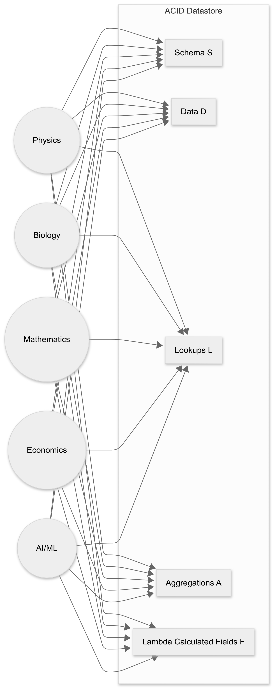

# The CMCC Complete Theory-of-Everything Meta Model

## Overview
This repo contains a self describing model for Math, Physics, Chemistry, Biology, Astronomy, Geology, AI Knowledge Management, Economics and more. These are all unified under one common CMCC Complete model, a conjecture that posits that the declarative semantics of any conceptual model can be captured using five fundamental primitives—Schema (S), Data (D), Lookups (L), Aggregations (A), and Lambda Calculated Fields (F)—within an Snapshot-Consistent environment. Demonstrating Turing-completeness and aligning with Wolfram’s multiway systems, CMCC provides a universal substrate for modeling domains ranging from physics and biology to business rules and beyond. This paper formalizes CMCC’s theoretical foundations, presents diverse cross-domain examples, and outlines future directions for building a unified computational framework

## TL;DR;
### The Model

To skip the rigamarole, and just cut to the chase, this is the [CMCC ToE Meta-Model](SSoT/cmcc-toe-meta-model.json).

The Conceptual Model Completeness Conjecture (CMCC) provides a unified, self‐describing framework for modeling domains as diverse as Mathematics, Physics, Chemistry, Biology, Astronomy, Geology, AI Knowledge Management, and Economics. Underpinned by five fundamental primitives—Schema (S), Data (D), Lookups (L), Aggregations (A), and Lambda Calculated Fields (F)—the CMCC model is both declarative and operational. It guarantees Turing-completeness and aligns with Wolfram’s multiway systems, offering a universal substrate for capturing the "what" of domain knowledge while leaving the "how" to the runtime.

## 🔴 HARDCORE CMCC FALSIFICATION CHECKLIST

⚠️ STOP! BEFORE YOU CLAIM CMCC FAILS, DOUBLE CHECK THAT YOU ACTUALLY DID THIS: ⚠️

✅ Step 1: DO NOT LIST 5 POSSIBLE PROBLEMS
   (Red Flags: IF your falsification attempt includes words like Could, May, Might, or Maybe, that is not a falsification, it is a presupposition - that is going to melt away under scrutiny)

✅ Step 2: PICK THE MOST OUTRAGEOUS RULE THAT YOU THINK BREAKS CMCC
   (Write it down. If you didn’t, you’re just assuming failure instead of testing it.)

✅ Step 3: DECOMPOSE IT INTO CMCC PRIMITIVES (S, D, L, A, F)
   (Write how it could be represented declaratively. If you skipped this, you didn’t actually test it.)

✅ Step 4: CHECK IF THE RUNTIME ENGINE CAN HANDLE IT
💡 Remember: CMCC defines the WHAT, not the HOW. The runtime executes the rules. Performance, and scaling are runtime concerns. Is your rule actually a runtime concern? 

✅ Step 5: IF YOU STILL THINK IT FAILS, TRY AGAIN
   Seriously. Every time I thought I falsified it, I realized I was looking at it wrong. Are you sure you aren’t just assuming imperative execution is required?

🚀 IF YOU STILL THINK CMCC FAILS… EMAIL ME YOUR CASE!
   (And expect me to ask if you really followed these steps. 😂)

#### [CMCC Research](/research/README.md)

This entire self describing model is based on the Conceptual Model Completeness conjecture.  
For a full list of thepapers, please see the [CMCC Research](/research/README.md) section.

## Theory of Everything (TOE) Domains

Below is a list of TOE models included in this repository. Click on any domain to read its detailed meta-model documentation:

### Mathematics CMCC Meta-Model
**CMCC Complete Mathematics ToE Meta-Model**

A structured model covering foundational mathematics, including sets, functions, proofs, structures, and category theory.. Read more about the [math](math/README.md) CMCC Complete Meta-Model.

### Physics ToE Meta-Model
**CMCC Complete Physics ToE Meta-Model**

A unified model for physics, including classical mechanics, quantum mechanics, gauge fields, wavefunctions, relativity, and black hole dynamics.. Read more about the [physics](physics/README.md) CMCC Complete Meta-Model.

### Chemistry ToE Meta-Model
**CMCC Complete Chemistry ToE Meta-Model**

Extends the Physics TOE with atomic structures, molecular interactions, bonds, and chemical reactions.. Read more about the [chemistry](chemistry/README.md) CMCC Complete Meta-Model.

### Biology ToE Meta-Model
**CMCC Complete Biology ToE Meta-Model**

Bridges Chemistry and Physics TOEs to model biological systems, including genes, proteins, metabolism, and cellular structures.. Read more about the [biology](biology/README.md) CMCC Complete Meta-Model.

### Artificial Intelligence ToE Meta-Model
**CMCC Complete Artificial Intelligence ToE Meta-Model**

Encapsulates machine learning, neural networks, training datasets, reinforcement learning, and inference mechanisms.. Read more about the [ai](ai/README.md) CMCC Complete Meta-Model.

### Economics ToE Meta-Model
**CMCC Complete Economics ToE Meta-Model**

A computational model for economic agents, markets, transactions, and supply-demand constraints.. Read more about the [economics](economics/README.md) CMCC Complete Meta-Model.

### Astronomy ToE Meta-Model
**CMCC Complete Astronomy ToE Meta-Model**

An extension of the Physics TOE to model celestial bodies, star systems, orbital dynamics, and large-scale cosmic structures.. Read more about the [astronomy](astronomy/README.md) CMCC Complete Meta-Model.

### Geology
**CMCC Complete Geology oE Meta-Model**

A model integrating physics and chemistry to represent minerals, rock formations, and tectonic processes.. Read more about the [geology](geology/README.md) CMCC Complete Meta-Model.

### Medicine & Healthcare ToE Meta-Model
**CMCC Complete Medicine and Healthcare ToE Meta-Model**

A unified model capturing foundational aspects of medicine and healthcare, including patient records, clinical trial data, treatment plans, and healthcare analytics.. Read more about the [medicine](medicine/README.md) CMCC Complete Meta-Model.

### Legal Systems & Compliance ToE Meta-Model
**CMCC Complete Legal Systems & Compliance ToE Meta-Model**

A unified model for legal systems, contracts, statutory frameworks, and regulatory compliance.. Read more about the [legal](legal/README.md) CMCC Complete Meta-Model.

### Climate Science ToE Meta-Model
**CMCC Complete Climate Science and Environmental Modeling ToE Meta-Model**

A unified model for climate science and environmental modeling, capturing climate variables, ecosystems, pollution sources, and environmental data with built-in predictive and forecast capabilities.. Read more about the [climate](climate/README.md) CMCC Complete Meta-Model.

### Cybersecurity ToE Meta-Model
**CMCC Complete Cybersecurity ToE Meta-Model**

A unified model for cybersecurity covering threat models, vulnerabilities, IT asset mappings, incident logs, and security audits.. Read more about the [cybersecurity](cybersecurity/README.md) CMCC Complete Meta-Model.

### Sociology & Anthropology ToE Meta-Model
**CMCC Complete Sociology and Anthropology ToE Meta-Model**

A structured model capturing social structures, cultural norms, and interaction networks using survey data, demographic records, and social network relationships.. Read more about the [sociology](sociology/README.md) CMCC Complete Meta-Model.

## Example: Mathematical Details

The Mathematics TOE Meta-Model illustrates how fundamental mathematical concepts are declaratively defined. For example:

### Sets
- **Definition:** A Set is a fundamental collection of mathematical objects. It defines the universe in which arithmetic and number theory are formulated.
- **Notable Aggregations:**  
  - *is_empty*: `COUNT(elements) = 0`  
  - *is_finite*: `countable AND cardinality != 'aleph_0'`
- **Lambda Functions:**  
  - *subset*: `CreateSet(elements.filter(predicate))`  
  - *power_set*: `GenerateAllSubsets(this)`

### Functions
- **Definition:** A Function maps a domain Set to a codomain Set and formalizes arithmetic operations and other transformations.
- **Notable Aggregations:**  
  - *is_injective*: `CheckInjectivity(rule)`  
  - *is_surjective*: `CheckSurjectivity(rule, codomain_set_id)`  
  - *is_bijective*: `is_injective AND is_surjective`
- **Lambda Functions:**  
  - *compose*: `ComposeRules(this.rule, LOOKUP(other_function_id).rule)`  
  - *inverse*: `IF is_bijective THEN InvertRule(rule) ELSE null`

### Structures
- **Definition:** Structures formalize algebraic systems (e.g., groups, rings, fields) by combining a base set with defined operations (like addition and multiplication) and relations.
- **Example:**  
  - *Ring of Integers*: Defines a ring over ℤ with operations for addition and multiplication, and an equality relation.

These examples (along with many formulas and lambda definitions) illustrate how the model not only documents the domain but also makes it directly executable.

## About
This repository is part of **The Conceptual Model Completeness Conjecture (CMCC)**, developed by **EJ Alexandra** (SSoT.me). For more information, please contact **start@anabstractlevel.com**.

---
*Generated from CMCC Metadata – Any updates to the metadata automatically update this README.*

LICENSE NON COMMERCIAL USE ONLY!  NO WARRANTY EITHER EXPRESSED OR IMPLIED.